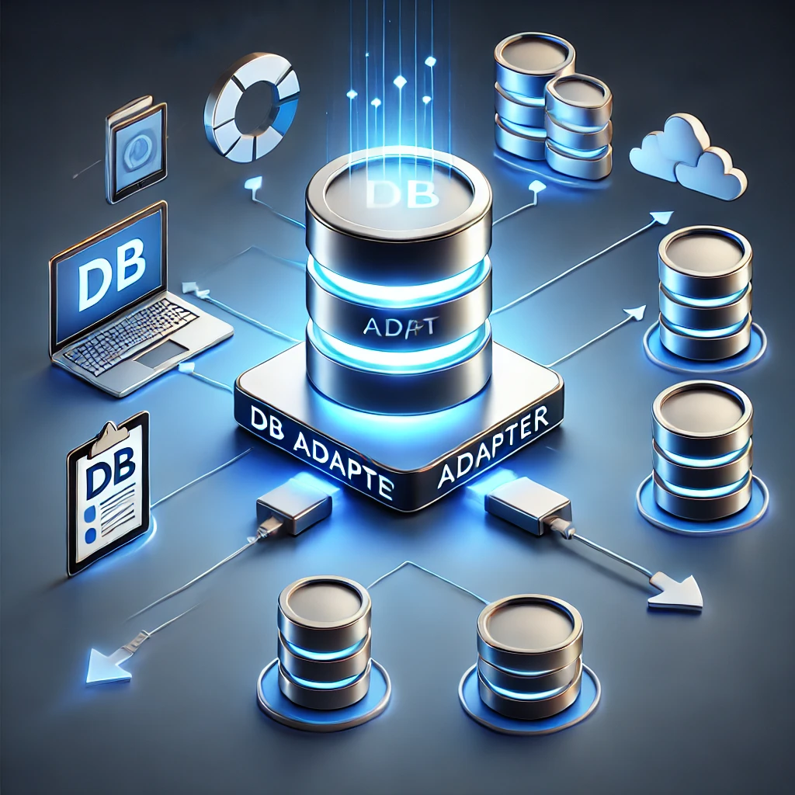

Documentation for: Database Adapter
===========================

-------

  

-------

# Database Adapter

A **database adapter** is a software component that serves as an intermediary between an application and a database. Its primary role is to abstract the underlying database-specific implementation details and provide a consistent interface for the application to perform database operations such as:

- **Connecting** to the database
- **Executing queries**
- **Fetching results**
- **Handling transactions**
- **Managing connections and resources**

## Key Functions of a Database Adapter

- **Abstraction**: Hides database-specific syntax and API differences, allowing developers to write code independent of the database engine (e.g., PostgreSQL, MySQL, SQLite).
- **Connection Management**: Establishes, reuses, and closes database connections efficiently.
- **Query Execution**: Facilitates sending SQL queries or commands to the database and receiving the results.
- **Data Mapping**: Translates raw database responses into usable application-level data structures (like objects or dictionaries).
- **Error Handling**: Captures and handles database-related errors gracefully.

## Why Use a Database Adapter?

- **Portability**: Easily switch between different database systems with minimal code changes.
- **Maintainability**: Keeps database interaction code clean and modular.
- **Security**: Helps prevent SQL injection and other database-related vulnerabilities through parameterized queries.

